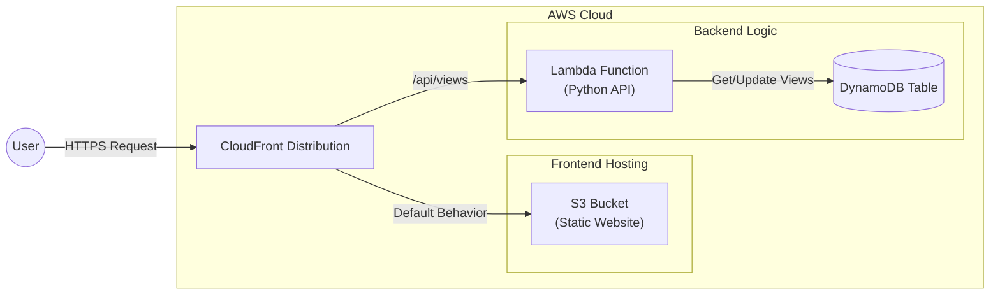

# AWS Serverless Terraform CI/CD Deployment

## 📖 Project Description

This project demonstrates a robust **Serverless DevOps workflow** on AWS. It hosts a portfolio website using a fully automated CI/CD pipeline powered by **GitHub Actions** and manages infrastructure using **Terraform**.

The architecture ensures high availability and security by serving content via CloudFront and keeping the S3 bucket private. The backend logic for the view counter is handled by a serverless Lambda function and DynamoDB.

**Key Features:**

- **Serverless Architecture**: Utilizes S3 for static hosting and Lambda/DynamoDB for backend logic.
- **Infrastructure as Code (IaC)**: 100% of the AWS infrastructure is provisioned and managed via Terraform.
- **Automated CI/CD**: Deployments are automated. Infrastructure changes and Frontend updates are triggered specifically when Pull Requests are merged into the `main` branch.
- **Secure Content Delivery**: Uses CloudFront for global caching, HTTPS termination, and Origin Access Control (OAC) to secure the S3 bucket.

## 🛠️ Tools Used

- **AWS (Amazon Web Services)**: The cloud provider used for all resources.
  - **S3**: Object storage for hosting the static frontend files (HTML, CSS, JS).
  - **CloudFront**: Content Delivery Network (CDN) to serve the website securely with low latency.
  - **Lambda**: Serverless compute service running Python for the backend API.
  - **DynamoDB**: Managed NoSQL database to store the website view count.
- **Terraform**: An open-source IaC tool used to define and provision the cloud infrastructure in a safe and predictable manner.
- **GitHub Actions**: Orchestrates the CI/CD pipeline, handling automated testing and deployment upon code merges.
- **Python**: The programming language used for the backend Lambda logic.

## 🚀 Setup & Usage

### Prerequisites

1. **AWS Account**: An active AWS account.
2. **S3 Backend Bucket**: You must manually create an S3 bucket named `arijit21-s3-backend-terraform` (or update `Terraform/backend.tf` with your own bucket name) to store the Terraform state file.
3. **Terraform**: (Optional) Install Terraform locally if you wish to run plans/destroys on your machine.
4. **AWS CLI**: (Optional) Configured with your credentials for local testing.

### GitHub Repository Setup

1. **Secrets**: Go to **Settings** -> **Secrets and variables** -> **Actions** and add:

   - `AWS_ACCESS_KEY`: Your AWS Access Key.
   - `AWS_SECRET_ACCESS_KEY`: Your AWS Secret Key.
   - `AWS_S3_BUCKET`: The name of your S3 bucket (Must match the `bucket-name` in your Terraform variables).

2. **Branch Protection**:

   - Go to **Settings** -> **Branches**.
   - Add a rule for **`main`**.
   - Check **"Require a pull request before merging"**.

### ⚙️ Initial Run (First Deployment)

Since there is no infrastructure yet, the first run needs to be triggered manually. We use the `workflow_dispatch` event for this.

1. **Trigger Infrastructure Deploy**:

   - Go to the **Actions** tab in GitHub.
   - Select **"Deploy Infrastructure"** from the left sidebar.
   - Click **Run workflow** -> Select `main` branch -> **Run workflow**.
   - Wait for this to complete (creates S3, Lambda, DynamoDB, etc.).

2. **Trigger Frontend Deploy**:

   - Select **"deploy to s3"** from the sidebar.
   - Click **Run workflow**.
   - This uploads your HTML/CSS/JS to the newly created bucket.

3. **Clean Up Workflow**:

   - Once fully deployed, verify your website works.
   - **Important**: Edit the workflow files and remove the `workflow_dispatch:` lines.
   - Commit these changes. Now, your pipeline is strictly "Pull Request" driven!

### 🔄 Standard Workflow (Deploying Changes)

1. Create a branch: `git checkout -b feature/new-style`
2. Make code changes.
3. Push and open a Pull Request to `main`.
4. Review and Merge. GitHub Actions will automatically deploy.

## 🧹 Cleanup

To destroy the infrastructure and stop incurring costs, follow these steps.

To destroy the infrastructure and stop incurring costs, you can use the manual **Destroy Workflow** in GitHub Actions.

1. Go to the **Actions** tab in your GitHub repository.
2. Select **"Destroy Infrastructure"** from the left sidebar.
3. Click the **Run workflow** button.
4. This will trigger a `terraform destroy` command in the CI environment, safely removing all resources.

**Note:** Just like with local destruction, if the S3 bucket is not empty, the destroy might fail. The workflow is configured to handle standard cleanup, but if you have manually uploaded extra files, you might need to empty the bucket via AWS Console first.
